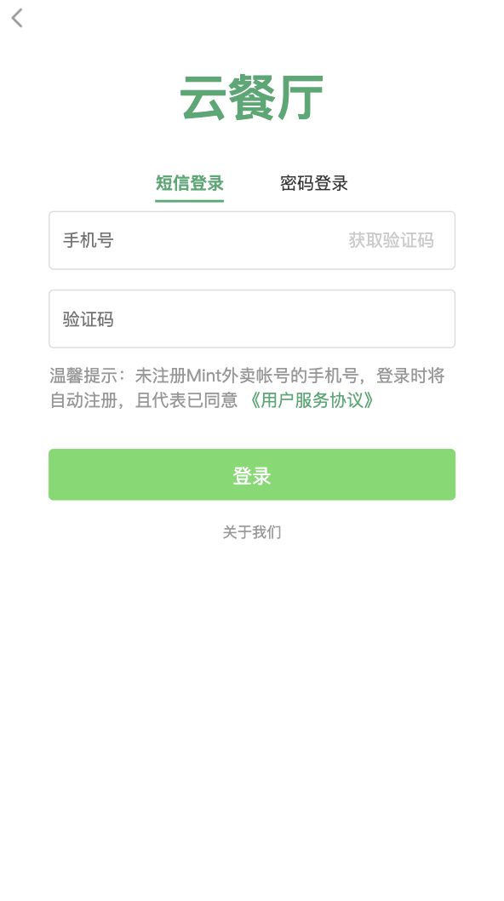
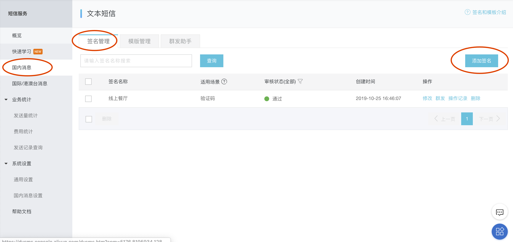
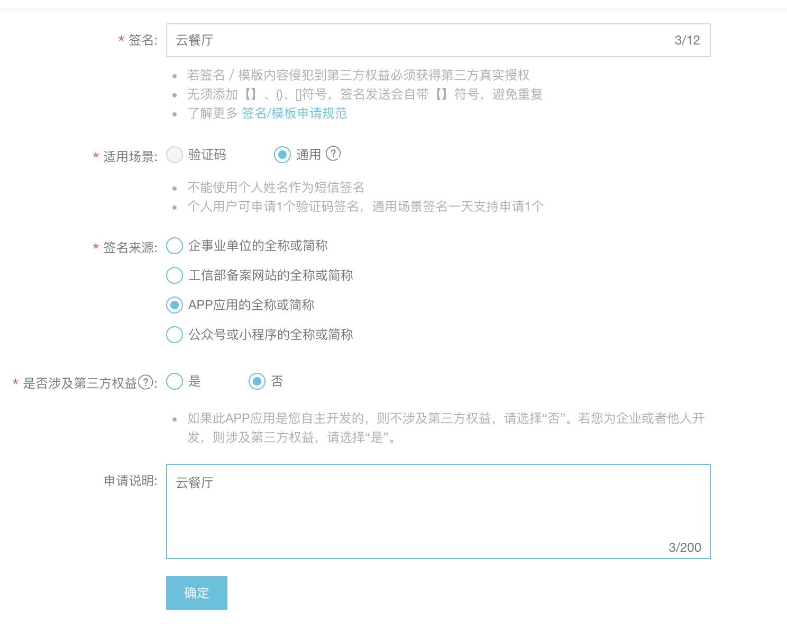
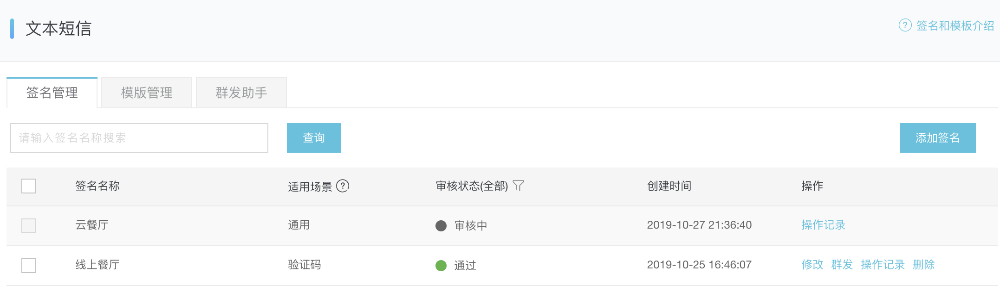
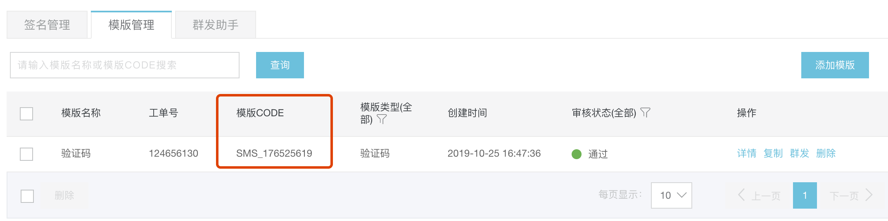
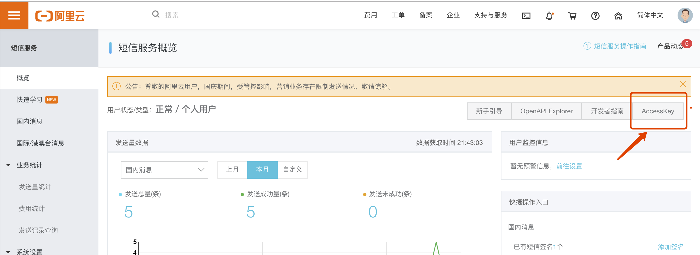
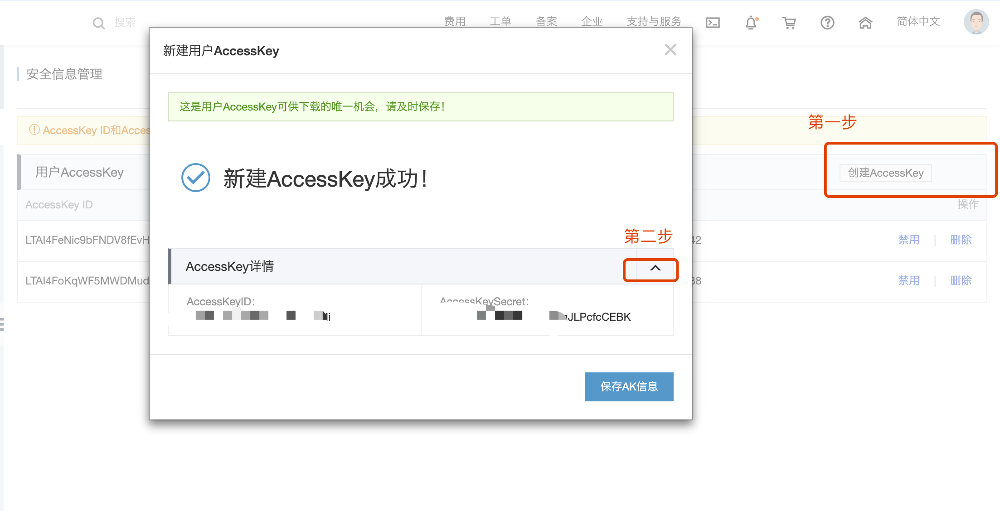
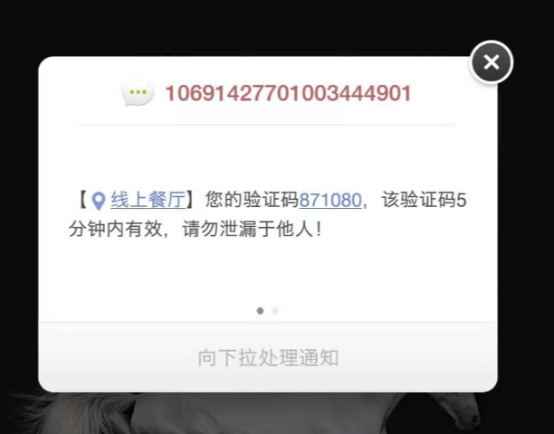

# 集成第三方发送短信功能

## 介绍


如上图，用户登录界面。用户登录有两种方式：短信登录、密码登录。

短信登录是使用手机号和验证码进行登录。

## 短信平台
很多云平台，比如阿里云，腾讯云，七牛云等云厂商，向程序开发者提供了短信验证码套餐服务。借助云平台的短信服务，程序开发者可以非常简单方便的将短信服务集成到自己的程序中。

在本节课中，我们以接入和集成阿里云的短信服务sdk为例进行讲解。

## 阿里云短信服务集成
在本次课程中，我们集成的短信服务以阿里云平台为例。在实际的开发和选择中，也可以是其他平台，原理类似。

### 登录阿里云
登录阿里云：[https://www.aliyun.com/](https://www.aliyun.com/)

选择短信服务模块：[https://www.aliyun.com/product/sms](https://www.aliyun.com/product/sms)

注明：云平台的短信服务是收费的，有不同类别的套餐。开发者可以按照自己的需求进行选择。如下图：


#### Go短信服务sdk
可以访问[https://api.aliyun.com/?spm=5176.12207334.0.0.54d71cbe3NE29f#/?product=Dysmsapi&lang=GO](https://api.aliyun.com/?spm=5176.12207334.0.0.54d71cbe3NE29f#/?product=Dysmsapi&lang=GO)查看go语言版本的短信服务sdk代码。

##### 1、安装阿里云Go SDK
```
go get github.com/aliyun/alibaba-cloud-sdk-go
```

##### 2、创建签名和短信模板
在使用go sdk集成短息服务之前，需要首先创建短信签名和短信模板。

**签名：**短信签名是短信服务提供的一种快捷、方便的个性化签名方式。当发送短信时，短信平台会根据设置，在短信内容里附加个性签名，再发送给指定手机号码。比如，下图红框中的"招商银行”就是这条短信的签名，用以标识发送者的类别等内容。


在阿里云后台的短信服务控制面板的左侧功能栏中，选择国内消息，如下图所示，然后选择签名管理的TAB，然后选择添加签名，可以创建新的短信签名。如下图:




**短信模板：**短信模版，即具体发送的短信内容。短信模版可以支持验证码、短信通知、推广短信三种模式。验证码和短信通知，通过变量替换实现个性短信定制。
与创建签名同理，可以在模板管理TAB中，选择添加模板，用来创建新的短信模板。创建完成后，会进行审核。

创建成功后的短信模板的模版CODE需要记住，后续会使用到。

##### 3、创建AccessKey和AccessKeySercet

在短信服务管理平台的概览界面，可以选择AccessKey按钮进行创建集成短信服务所需要的AccessKey和AccessKeySecret。


##### 4、在程序中集成短信服务
```
...
client, err := dysmsapi.NewClientWithAccessKey(smsConfig.RegionId, smsConfig.AppKey, smsConfig.AppSecret)
	if err != nil {
		toolbox.Error(err.Error())
		return ""
	}

	request := dysmsapi.CreateSendSmsRequest()
	request.Scheme = "https"

	request.SignName = smsConfig.SignName
	request.TemplateCode = smsConfig.TemplateCode
	request.PhoneNumbers = phone
	par, err := json.Marshal(map[string]interface{}{
		"code": code,
	})
	request.TemplateParam = string(par)

	response, err := client.SendSms(request)
	
	fmt.Println( response)
	if err != nil {
		toolbox.Error(err.Error())
		return ""
	}
...
```
我们通过上述核心代码程序，完成阿里云短信服务的集成。其中：
* SignName：在阿里云后台创建的前名，必传参数。
* TemplateCode：在阿里云后台创建的短信模板ID，必传参数。
* PhoneNumbers：接收短信的手机号码，必传参数。

创建阿里云短信服务sdk的client时，需要传regionID、appKey、accessKeySecret三个参数。regionID表示的是区域ID，可以填写cn-hangzhou。


#### 创建Controller解析请求
无论是短信登录，还是用户名和密码登录，均属于用户功能模块。因此，创建MemberController用于解析用户模块的各个请求：
```
type MemberController struct {
}

func (mc *MemberController) Router(engine *gin.Engine) {
	//发送手机验证码
	engine.GET("/api/sendcode", mc.sendSmsCode)
}

func (mc *MemberController) sendSmsCode(context *gin.Context) {
	phone, exist := context.GetQuery("phone")
	if !exist {
		toolbox.Failed(context, "参数解析失败")
		return
	}

	service := impl.NewMemberService()
	code := service.SendCode(phone)
	if code != "" {
		toolbox.Success(context, code)
		return
	}
	toolbox.Failed(context, "验证码发送失败")
}
```
创建用户控制层程序MemberController,使用GET方法解析客户端发送短信验证码的请求，请求接口为：/api/sendcode，同时指定sendSmsCode方法处理接口请求。

在实际的开发中，程序功能往往是分层来进行开发的，controller层只负责控制和处理接口请求的逻辑，具体的功能调用，往往由另外称为service层的功能服务层来进行实现。

#### 创建service层
在service层中，依然按照模块化开发的理念，将用户模块的服务统一由UserServicej进行提供。因此，创建MemberService,并提供SendCode方法。

```
type MemberService struct {
}

func (msi *MemberService) SendCode(phone string) string {
    code := fmt.Sprintf("%06v", rand.New(rand.NewSource(time.Now().UnixNano())).Int31n(1000000))

	smsConfig := toolbox.GetConfig().Sms
	//调用阿里云短信接口发送短信
	client, err := dysmsapi.NewClientWithAccessKey(smsConfig.RegionId, smsConfig.AppKey, smsConfig.AppSecret)
	if err != nil {
		toolbox.Error(err.Error())
		return ""
	}

	request := dysmsapi.CreateSendSmsRequest()
	request.Scheme = "https"

	request.SignName = smsConfig.SignName
	request.TemplateCode = smsConfig.TemplateCode
	request.PhoneNumbers = phone
	par, err := json.Marshal(map[string]interface{}{
		"code": code,
	})
	request.TemplateParam = string(par)

	response, err := client.SendSms(request)
	
	fmt.Println( response)
	if err != nil {
		toolbox.Error(err.Error())
		return ""
	}

	if response.Code != "OK" {
		return ""
	}
	return code
}
```

#### 测试
在postman中，使用/api/sendcode接口进行测试，详细url如下：
```
http://localhost:8090/api/sendcode?phone=13167582436
```
然后，能在手机端收到验证码:



