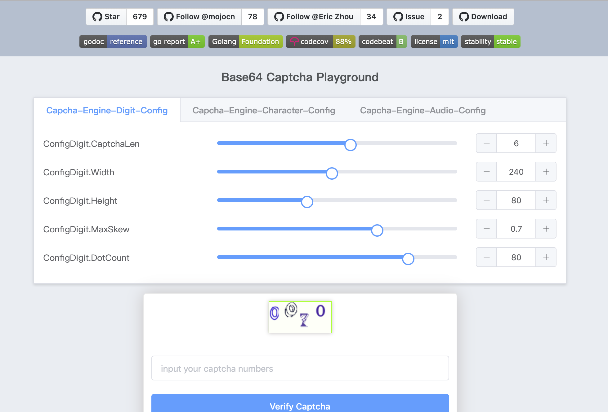
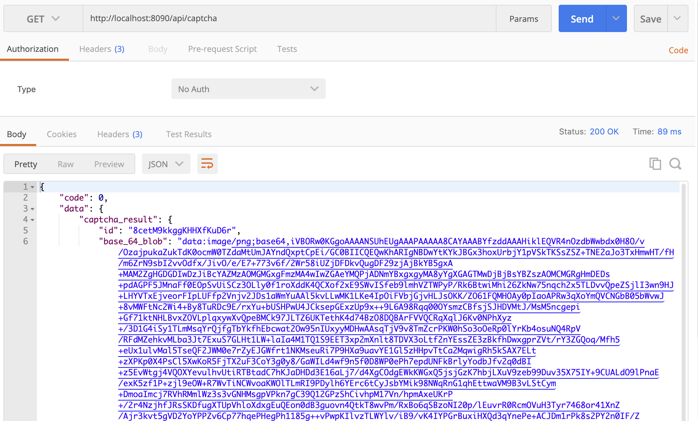

# 图形化验证码生成和验证

## 功能介绍
在使用用户名和密码登录功能时，需要填写验证码，验证码是以图形化的方式进行获取和展示的。

## 验证码使用原理
验证码的使用流程和原理为：在服务器端负责生成图形化验证码，并以数据流的形式供前端访问获取，同时将生成的验证码存储到全局的缓存中，在本案例中，我们使用redis作为全局缓存，并设置缓存失效时间。当用户使用用户名和密码进行登录时，进行验证码验证。验证通过即可继续进行登录。

## 验证码库安装
借助开源的验证码工具库可以生成验证码。
首先，安装开源的验证码生成库：
```
go get -u github.com/mojocn/base64Captcha
```

## 验证码代码示例
在下载后的base64Captcha库的目录中，可以看到有_example和_example_redis两个目录。第一个example是用于演示生成验证码和验证码的示例代码。

按照示例代码的说明，运行程序并在浏览器进行端口访问：
```
go run main.go
//浏览器中访问：http://localhost:8777
```
如下图所示：

通过自定义配置，可以选择不同的生成验证码的参数，并刷新验证码，同时还可以对验证码进行验证。

通过exmaple目录下的main.go程序可以看到生成验证码和验证验证码的逻辑，此处不再赘述。

## 项目集成验证码生成和Redis缓存
通常来说，验证码都是有一定的实效性的，过期验证码也就无效了。

因此，我们考虑在项目中引入Redis作为数据缓存。当验证码生成后，将验证码存放在Redis中，并根据配置文件对Redis进行设置。

### 安装go-redis库
在项目中使用redis,需要安装go-redis库，可以在[https://github.com/go-redis/redis](https://github.com/go-redis/redis)中查看如何下载go-redis和配置。

### 增加Redis配置
在配置文件app.json中新增redis配置：
```
...
"redis_config": {
    "addr": "127.0.0.1",
    "port": "6379",
    "password": "",
    "db": 0
}
...
```
同时，新增RedisConfig结构体定义，如下所示：
```go
type RedisConfig struct {
	Addr string `json:"addr"`
	Port string `json:"port"`
	Password string `json:"password"`
	Db   int    `json:"db"`
}
```

### Redis初始化操作
进行了redis配置以后，需要对redis进行初始化。可以封装redis初始化操作函数如下所示：
```go
type RedisStore struct {
	redisClient *redis.Client
}

var Redis *redis.Client

func InitRediStore() *RedisStore {
	config := GetConfig().RedistConfig

	Redis = redis.NewClient(&redis.Options{
		Addr:     config.Addr + ":" + config.Port,
		Password: config.Password,
		DB:       config.Db,
	})

	customeStore := &RedisStore{Redis}
	base64Captcha.SetCustomStore(customeStore)

	return customeStore
}

```

同时，为customeStore提供Set和Get两个方法，如下所示：
```go
func (cs *RedisStore) Set(id string, value string) {
	err := cs.redisClient.Set(id, value, time.Minute*2).Err()
	if err != nil {
		log.Println(err.Error())
	}
}

func (cs *RedisStore) Get(id string, clear bool) string {
	val, err := cs.redisClient.Get(id).Result()
	if err != nil {
		toolbox.Error(err.Error())
		return ""
	}
	if clear {
		err := cs.redisClient.Del(id).Err()
		if err != nil {
			toolbox.Error(err.Error())
			return ""
		}
	}
	return val
}
```

对Redis进行初始化和定义完成以后，需要在main中调用一下初始化操作InitRediStore:
```go
func main(){
    ...
    //Redis配置初始化
	 toolbox.InitRediStore()
    ...
}
```

### 验证码生成和验证
本项目中采用的验证码的生成库支持三种验证码，分别是：audio，character和digit。我们选择character类型。

定义Captcha.go文件，实现验证码的生成和验证码函数的定义。在进行验证码生成时，默认提供验证码的配置，并生成验证码后返回给客户端浏览器。如下是生成验证码的函数定义：
```go
//生成验证码
func GenerateCaptchaHandler(ctx *gin.Context) {
	//图形验证码的默认配置
	parameters := base64Captcha.ConfigCharacter{
		Height:             60,
		Width:              240,
		Mode:               3,
		ComplexOfNoiseText: 0,
		ComplexOfNoiseDot:  0,
		IsUseSimpleFont:    true,
		IsShowHollowLine:   false,
		IsShowNoiseDot:     false,
		IsShowNoiseText:    false,
		IsShowSlimeLine:    false,
		IsShowSineLine:     false,
		CaptchaLen:         4,
		BgColor: &color.RGBA{
			R: 3,
			G: 102,
			B: 214,
			A: 254,
		},
	}

	captchaId, captcaInterfaceInstance := base64Captcha.GenerateCaptcha("", parameters)
	base64blob := base64Captcha.CaptchaWriteToBase64Encoding(captcaInterfaceInstance)

	captchaResult := CaptchaResult{Id: captchaId, Base64Blob: base64blob}

	// 设置json响应
	tool.Success(ctx, map[string]interface{}{
		"captcha_result": captchaResult,
	})
}
```

### 验证码接口解析
图形化验证码是用户名和密码登录功能的数据，属于Member模块。因此在MemberController中增加获取验证码的接口解析，如下：
```go
func (mc *MemberController) Router(engine *gin.Engine){
    //获取验证码
    engine.GET("/api/captcha", mc.captcha)
}
```

测试结果如下，能够正常获取到数据：


### 验证码的验证
同理，可以对客户端提交的验证码进行验证，具体实现逻辑如下:
```go
//验证验证码是否正确
func CaptchaVerify(r *http.Request) bool {
	
	var captchaResult CaptchaResult
	//接收客户端发送来的请求参数
	decoder := json.NewDecoder(r.Body)
	err := decoder.Decode(&captchaResult)
	if err != nil {
		log.Println(err)
	}
	defer r.Body.Close()

	//比较图像验证码
	verifyResult := base64Captcha.VerifyCaptcha(captchaResult.Id, captchaResult.VertifyValue)

	return verifyResult
}
```


