## 搭建FastDFS分布式文件系统

### 功能及背景介绍
在上节课中，完成了个人中心模块，用户可以上传图片，修改并保存用户头像的功能。除此之外，在正常的开发中，也经常会有文件上传的功能和需要。

在实际的开发中，涉及到文件上传的功能，往往单独搭建一个文件服务器用于文件的存储。因此我们接下来就搭建一个分布式的文件系统，并将已完成的文件上传功能进行优化，将文件存储到分布式文件系统中。

在本API项目中，我们通过搭建fastDFS文件系统来实现文件上传和存储的功能。

### FastDFS介绍
目前已经有很多开源的分布式文件系统。而fastDFS正是其中一员，fastDFS是基于http协议的分布式文件系统，其设计理念是一切从简。也正是因为其简单至上的设计理念，使其运维和扩展变得更加简单，同时还具备高性能，高可靠，无中心以及免维护等特点。

### FastDFS的特点
fastDFS分布式文件存储系统主要解决了海量数据的存储问题，利用fastDFS系统，特别适合系统中的中小文件的存储和在线服务。中小文件的范围大致为4KB ~ 500MB大小之间。

### FastDFS的组件构成及工作原理
在fastDFS分布式文件存储系统中，由三中角色的组件组成，分别称之为：跟踪服务器（Tracker Server）、存储服务器（Storage Server）和客户端（Client）。

每个角色组件都有各自的作用和功能：
* 存储服务器：即Storage Server。存储服务器顾名思义就是用于存储数据的服务器，主要提供存储容量和备份服务。存储服务器为了保证数据安全不丢失，会多台服务器组成一个组，又称group。同一个组内的服务器上的数据互为备份。
* 跟踪服务器：英文称之为Tracker Server。跟踪服务器的主要作用是做调度工作，担负起均衡的作用；跟踪服务器主要负责管理所有的存储服务器，以及服务器的分组情况。存储服务器启动后会与跟踪服务器保持链接，并进行周期性信息同步。
* 客户端：主要负责上传和下载文件数据。客户端所部署的机器就是实际项目部署所在的机器。

FastDFS的组件架构和工作原理如下图所示：
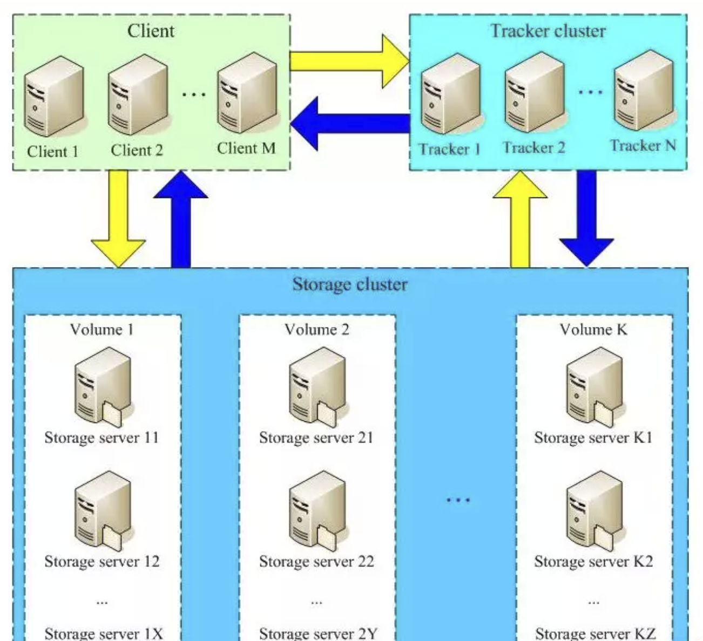

如上图所示，FastDFS在整个存储数据的过程中，整个存储服务器集群，是按照group为单位进行分组的，也可以称之为卷（volume）。整个存储系统分为多个组，组与组之间是相互独立的，并可以进行编号排序等，方便管理，所有的分组服务器组合起来就构成了整个fastDFS文件存储系统。

对某个组而言，其中可能包含一台或者多台文件存储服务器。比如上图中的Volume1，有称之为卷1，里面包含storage server11、storage server 12、...、1x共x台服务器。组成卷1的x台服务器上存储的文件内容是相同的。之所以每一组由多台服务器组成，并保持文件内容相同，主要的目的是为了实现冗余备份，以及负载均衡。

除此之外，在增加某个组的服务器机器时，FastDFS可以自动完成文件同步，自动切换服务器提供线上服务。当然，也可以新增新的组，完成对文件系统容量的扩容，FastDFS也是支持的。

### FastDFS文件上传过程
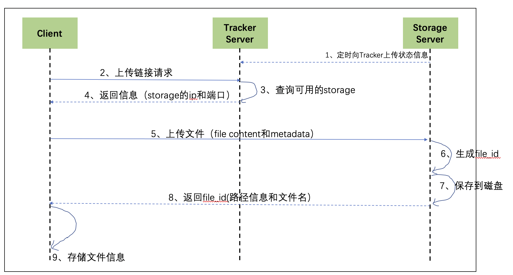

1、Storage Server会定期的向Tracker Server发送自己的存储信息。

2、当Tracker Server Cluster中的Tracker Server不止一个时，各个Tracker之间的关系是对等的，因此客户端上传时可以选择任意一个Tracker。

3、当Tracker收到客户端上传文件的请求时，会为该文件分配一个可以存储文件的group，当选定了group后就要决定给客户端分配group中的哪一个storage server。

4、当分配好storage server后，客户端向storage发送写文件请求，storage将会为文件分配一个数据存储目录。

5、然后为文件分配一个fileid，最后根据以上的信息生成文件名存储文件。

### FastDFS文件下载过程
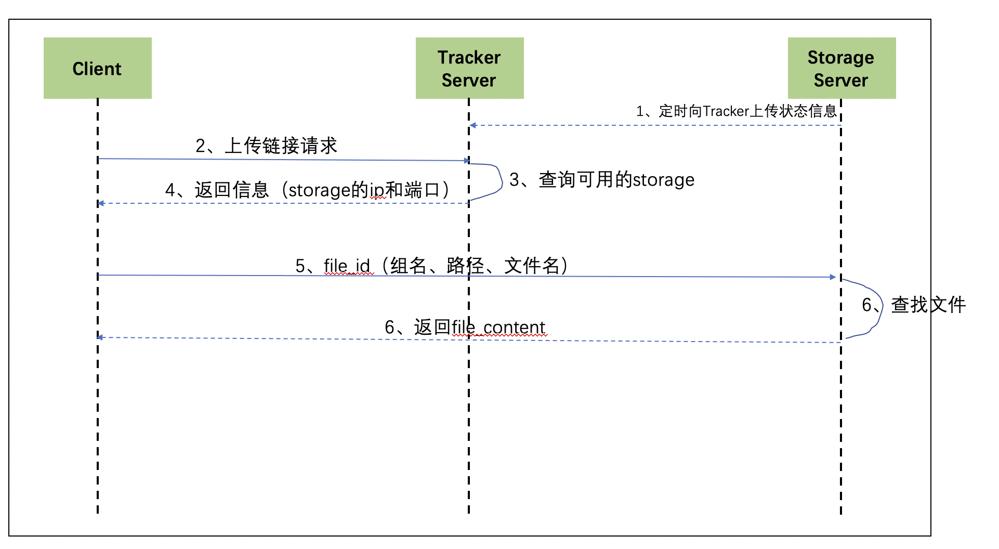
1、在下载文件时，客户端可以选择任意tracker server。

2、tracker发送下载请求给某个tracker，并携带着文件名信息。

3、tracker从文件名中解析出文件所存储的group、文件大小、创建时间等信息，然后为该请求选择一个storage用来服务下载的请求。

### 安装fastDFS
fastDFS是一个分布式文件存储系统，可以大规模部署在多台服务器上。本课程中，我选择使用云服务器来搭建fastDFS，这样方便访问。如果在学习本课程时，自己没有云服务器的条件，也可以选择自己的电脑本地环境，其原理和操作都是相同的。

#### 环境要求
CentOS 7版本。

#### 安装文件
fastDFS环境搭建主要分为两部分：第一部分是FastDFS安装、配置和服务启动，第二部分是配置Nginx模块。

##### FastDFS安装、配置和服务启动
* 1、下载libfastcommon并安装
libfastcommon是由fastDFS官方提供的软件库，其中包含了运行fastDFS所需要的一些基础库。可以直接通过浏览器访问并下载该文件：[https://github.com/happyfish100/libfastcommon/archive/V1.0.7.tar.gz](https://github.com/happyfish100/libfastcommon/archive/V1.0.7.tar.gz),下载后上传到Cent OS服务器上。也可以在centos终端中直接下载：

    ```
    wget https://github.com/happyfish100/libfastcommon/archive/V1.0.7.tar.gz
    ```

    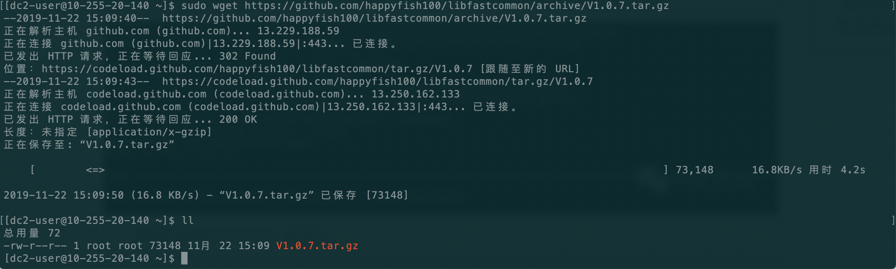

    下载和上传的libfastcommon库文件是tar压缩格式，需要进行解压缩：
    ```
    tar -zxvf V1.0.7.tar.gz
    ```

    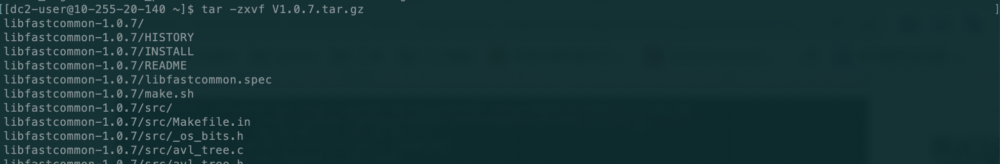
    
    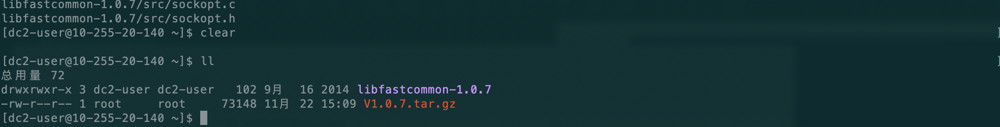

* 2、编译并安装libfastcommon
```
cd libfastcommon-1.0.7
./make.sh
```
./make.sh是执行编译脚本。编译过程需要系统有gcc环境，如果centos系统没有，会提示如下错误。

出现上图的错误时，请先安装gcc环境，安装命令如下：
```
sudo yum -y install gcc automake autoconf libtool make
```
等待安装完成即可，重新执行./make.sh。编译完成，编译过程会有输出：
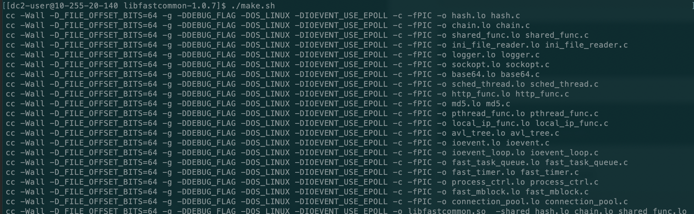

编译结束后进行安装，安装命令如下：
```
./make.sh install
```
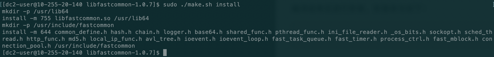
出现如上截图中的内容，即表示安装成功。

* 3、下载fastDFS并安装
安装完成libfastcommon之后，安装fastDFS。fastDFS可以通过如下链接进行访问和下载：[https://github.com/happyfish100/fastdfs/archive/V5.05.tar.gz](https://github.com/happyfish100/fastdfs/archive/V5.05.tar.gz)，下载后上传到CentOS服务器上。当然也可以使用命令在CentOS服务器上进行下载:

    ```
    wget https://github.com/happyfish100/fastdfs/archive/V5.05.tar.gz
    ```
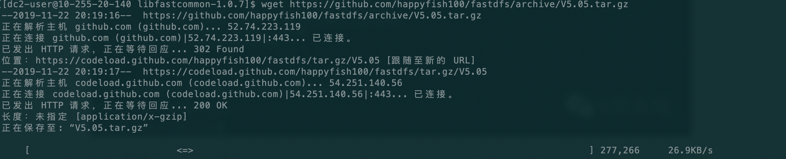
如上图即是下载fastDFS的截图。解压下载后的fastDFS的tar压缩包：
```
tar -zxvf V5.05.tar.gz
```
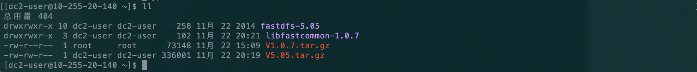

    解压后，进入解压后的目录，执行编译和安装，步骤如下：
```
cd fastdfs-5.05
./make.sh
sudo ./make.sh install 
```
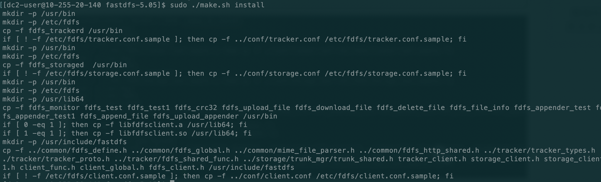

* 4、配置Tracker服务
结合前文所述的fastDFS的架构组成和存储文件原理。我们首先配置并启动Tracker服务。

    * 1、首先进入/etc/fdfs目录,在该目录下能够看到有三个默认的配置模板文件，并修改三个配置文件，去掉.sample后缀如下图所示：
    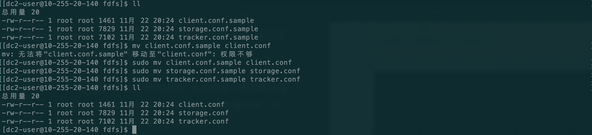
    * 2、编辑tracker.conf文件，进行配置：vim tracker.conf，需要配置的选项有以下几个：
    
        ```
        base_path=/home/dc2-user/data/fastdfs
        http.server_port=80
        ```
        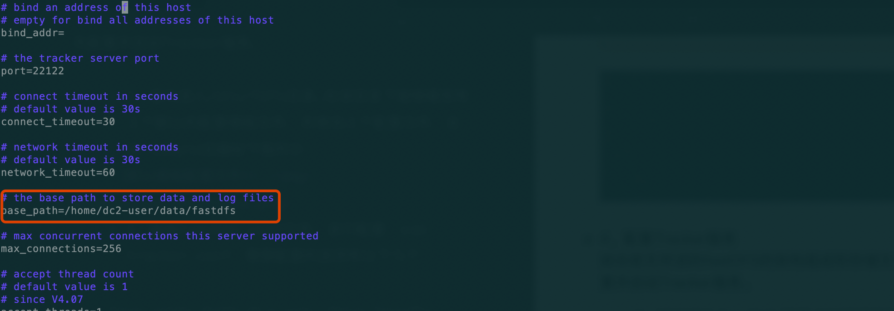
        base_path所指向的目录是指的tracker服务器数据存储的目录，如果不存在要首先创建。配置编辑完成后保存退出。
    
    * 3、启动Tracker服务，在终端中可以执行以下命令启动Tracker服务：
    
        ```
         /usr/bin/fdfs_trackerd /etc/fdfs/tracker.conf start
        ```
        该条命令执行后，可能没有信息输出，我们不知道Tracker服务是否已经启动。可以通过以下命令查看fdfs的tracker服务的监听：
        ```
        netstat -unltp|grep fdfs
        ```
        
        如上所示，tracker服务正在22122端口监听，说明已经正常启动了。
        
* 5、配置Storage服务
配置完成Tracker服务器以后，还要配置真正存储文件的存储服务器，即Storage服务。
    * 1、修改上文重命名的storage.conf配置文件。对storage.conf配置文件做如下选项配置并保存：
    
        ```
        base_path=/home/dc2-user/data/fastdfs_storage
        store_path0=/home/dc2-user/data/fastdfs_storage
        tracker_server=10.255.20.140:22122
        ```
        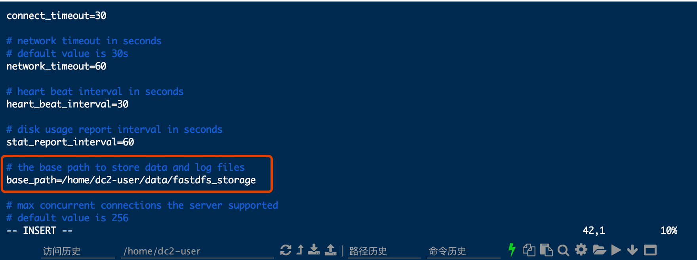
        相同原理，/home/dc2-user/data/fastdfs_storage需要自己创建或者已存在的目录。
        tracker_server选项配置的正是前文启动的tracker服务器的ip和端口。
        
    * 2、启动storage服务。通过如下命令启动storage服务：
    ```
    /usr/bin/fdfs_storaged /etc/fdfs/storage.conf start
    ```
    上述命令执行后，没有输出。依然可以通过下述命令来查看fdfs服务端口监听：
    ```
    netstat -unltp|grep fdfs
    ```
    
    如图所示，storage服务和tracker服务都已经启动。
    

至此，关于fastDFS的环境和启动配置就已经完成了。但是目前还无法访问，需要配置Nginx模块才可以进行上传和访问测试。


    
    


