## FastDFS文件系统配置Nginx模块并测试

### 背景介绍
上文我们搭建完成了FastDFS系统，但是还暂时不能测试，这是因为在服务器上搭建好了fastDFS系统后，只能上传，但是没有办法查看。如果想要查看，需要配置好nginx才能进行访问和测试。

### 配置Nginx模块
* 1、首先第一步下载Nginx和fastdfs-nginx-module。可以通过命令下载：
    
    ```
    wget -c https://nginx.org/download/nginx-1.10.1.tar.gz
    //同时，准备好fastdfs-nginx-module_v1.16.tar版本
    ```
    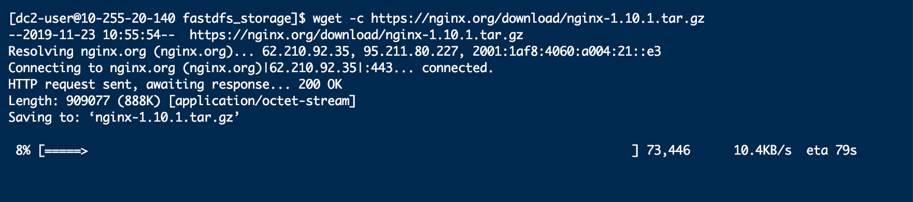
    下载并解压后使用如下命令进行安装:
    ```
    cd nginx-1.10.1
    ./configure --add-module=../fastdfs-nginx-module-master/src/
    ```
    如上命令是安装nginx，并添加fastdfs模块。nginx的安装需要一些其他环境。如果这些环境没有安装的话，可能会报错，如下图所示提示xxx...not found：
    
    如果出现类似上述报错的输出，则表示需要先安装一些依赖环境，nginx安装所依赖的一些库安装如下：
    ```
    sudo yum install gcc-c++
    sudo yum install -y pcre pcre-devel
    sudo yum install -y zlib zlib-devel
    sudo yum install -y openssl openssl-devel
    ```
    上述安装库命令全部执行成功后，可以再次执行./configure --add-module=../fastdfs-nginx-module-master/src/命令，即可执行成功如下图所示：
    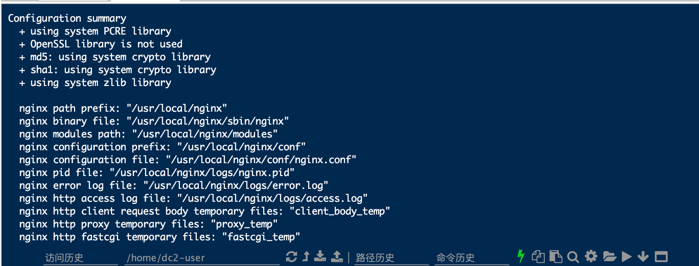

* 2、修改配置，解决错误，安装nginx
使用以下命令安装nginx：
```
cd nginx-1.10.1
make install
```
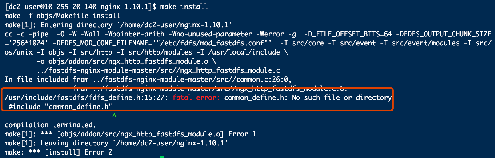
安装nginx，会提示如下错误。通过编辑fastdfs-nginx-module配置文件解决该错误：
```
sudo vim /home/dc2-user/fastdfs-nginx-module-master/src/config
```
其中fastdfs-nginx-module-master/src/config是指的fastdfs-nginx-module-master目录下的一个config配置文件，写自己的路径即可。
编辑config文件，修改ngx_module_incs和CORE_INCS两个配置项，修改为以下内容：
    
    ```
    CORE_INCS="$CORE_INCS /usr/include/fastdfs /usr/include/fastcommon/"
    ```
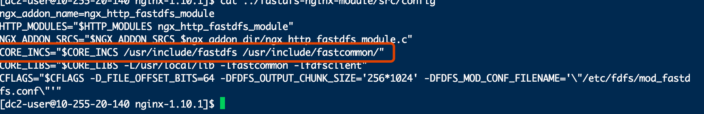
修改后的配置文件如上图所示。
重新执行编译安装的命令:
```
 ./configure --add-module=../fastdfs-nginx-module/src/
 make
 make install
```
最后，编译并安装成功。
安装成功后，可以通过命令查看nginx的版本号：
```
/usr/local/nginx/sbin/nginx -V
```
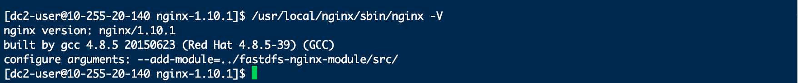

* 3、配置fastdfs-nginx-module和Nginx
进入到fastdfs-nginx-module/src目录下面，修改其中的一个名称为mod_fastdfs.conf的文件。修改该配置文件的三个配置选项：
```
tracker_server=10.255.20.140:22122
url_have_group_name = true
store_path0=/home/dc2-user/data/fastdfs_storage
```
    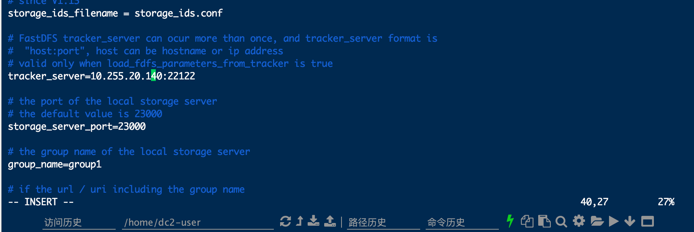
    修改完成后，将该文件拷贝到/etc/fdfs目录中。
    ```
    cp mod_fastdfs.conf /etc/fdfs
    ```
    
    下一步将/home/dc2-user/fastdfs-5.05目录中的配置文件拷贝到/etc/fdfs中:
    ```
    cd /home/dc2-user/fastdfs-5.05
    cp anti-steal.jpg http.conf mime.types /etc/fdfs/
    ```
    
* 4、修改Nginx配置文件，配置Nginx。因为前文已经创建了存储文件的目录/home/dc2-user/data/fastdfs_storage，要想通过http访问该目录，我们需要在nginx中进行相应的配置。编辑nginx的配置文件nginx.conf文件：
    ```
    cd /usr/local/nginx/conf
vi nginx.conf
    ```
    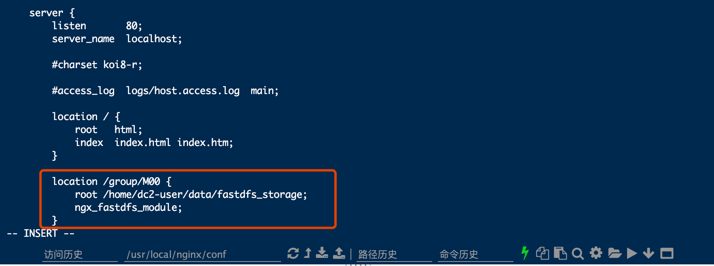
    在配置文件中加入上图中的红框中的内容，root所对应的目录即是前文创建的存储文件的目录。其他内容不变即可。
    
    由于我们配置了group1/M00的访问，我们需要建立一个group1文件夹，并建立M00到data的软链接。
    ```
    mkdir /home/dc2-user/data/fastdfs_storage/data/group1
    ln -s /home/dc2-user/data/fastdfs_storage/data /home/dc2-user/data/fastdfs_storage/data/group1/M00
    ```
至此，环境配置已经结束。

* 5、启动Nginx。采用如下命令启动Nginx服务：
```
sudo /usr/local/nginx/sbin/nginx
```


* 6、通过浏览器访问。在浏览器中的地址栏，输入搭建环境的服务器地址，出现如下所示效果，即表示Nginx服务启动成功:
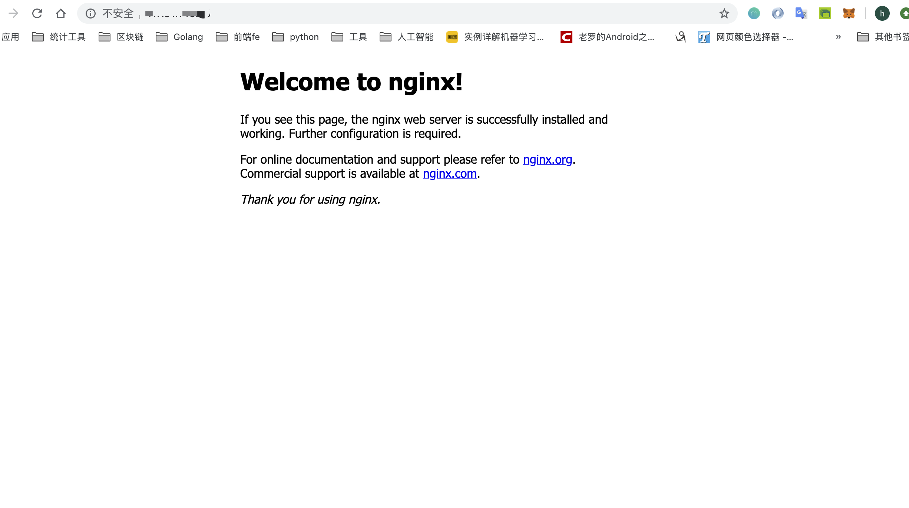

* 7、测试文件上传。接下来可以测试文件上传功能。
在任意目录下，创建一个hello.txt文件，然后执行如下命令：
```
/usr/bin/fdfs_test /etc/fdfs/client.conf upload ./hello.txt
```
出现下图所示效果，即表示上传成功：
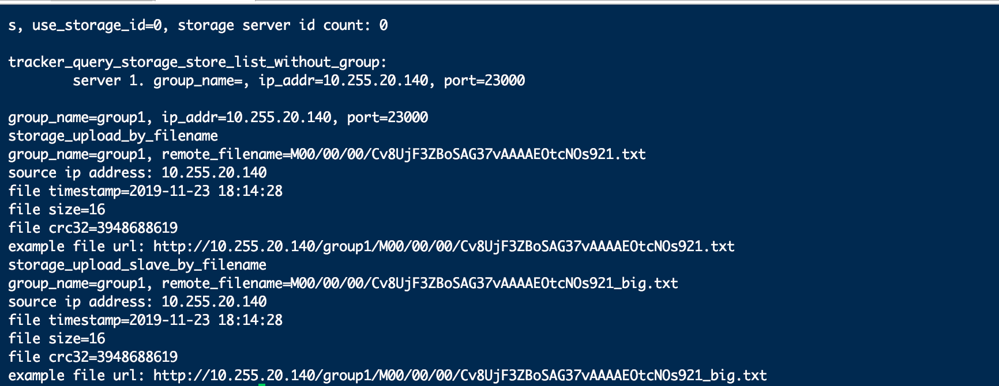
在对应的目录中，我们也可以找到该文件：
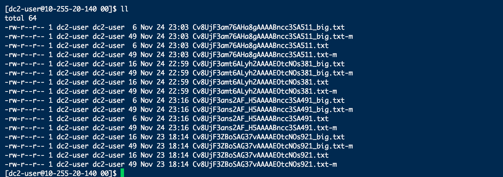

* 8、配置云服务器的访问端口。因为整个配置是在云服务器的环境中实现，需要通过配置，放行22122，23000端口才能进行访问，因此对云服务器中开放22122，23000端口配置：

在浏览器中输入对应的文件上传后的连接，能看到文件的内容，如下图所示：
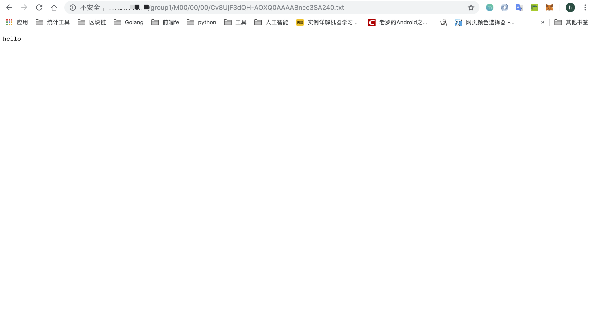

### 总结
至此，整个的FastDFS的配置和Nginx的配置，以及文件上传测试就完成了。在学习的过程中，如果没有云服务器，也可以使用虚拟机或者自己的计算机作为服务器环境搭建也是可以的,需要更换的就是ip，本地服务器不需要放行端口，只需要把防火墙关闭就可以了。关闭防火墙的命令如下：
```
firewall-cmd --zone=public --add-port=22122/tcp --permanent
firewall-cmd --zone=public --add-port=23000/tcp --permanent
```

