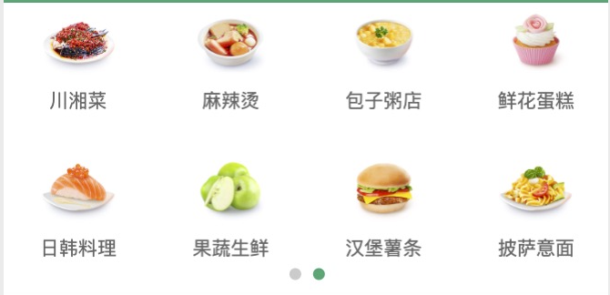
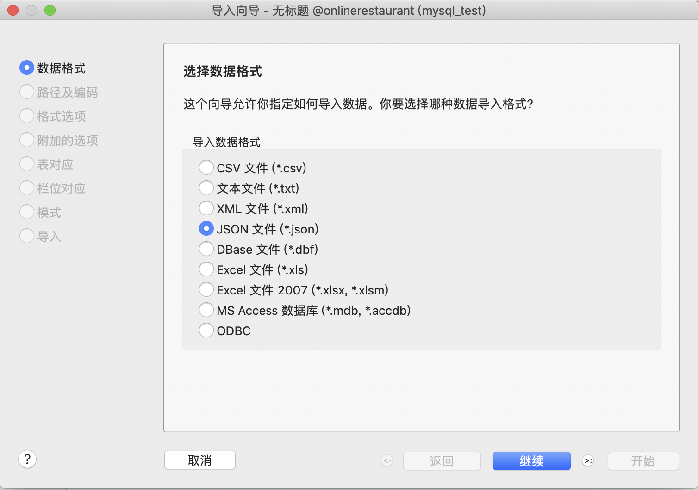
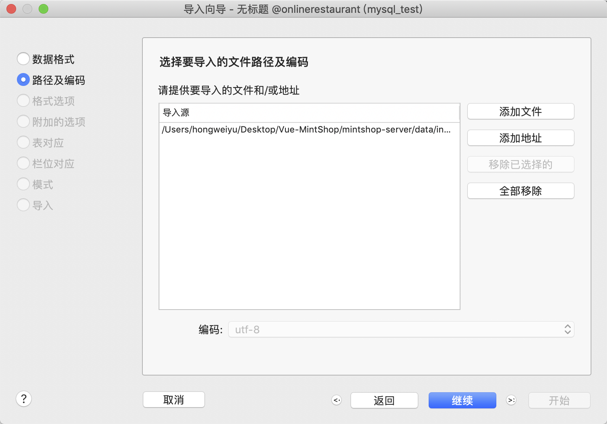
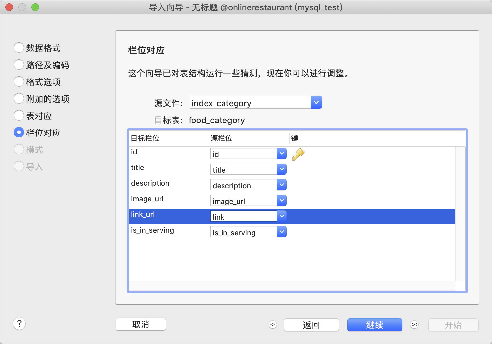
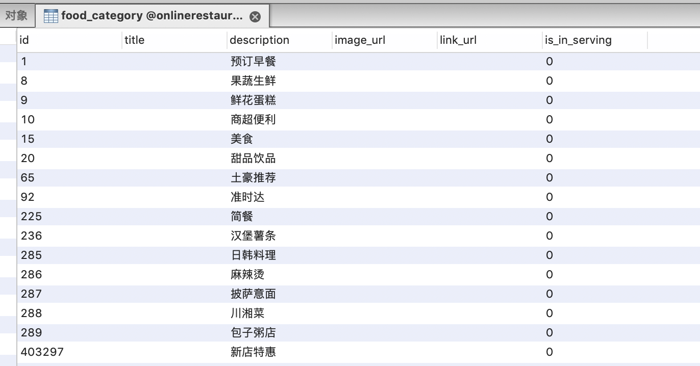

## 获取食品类别数据

### 功能介绍

在上述图片中，可以看到是按照类别对食物进行了区分。每个食品类别都各自有对应的对应类别的详细内容，本节课实现该美食类别的数据表结构创建和数据结构功能开发。

### 创建美食类别表结构
#### 1、结构体定义
在服务端，通过结构体定义来定义美食类别，命名为FoodCategory，具体定义如下所示：
```go
/**
 * 食品种类
 */
type FoodCategory struct {
	//类别ID
	Id int64 `xorm:"pk autoincr" json:"id"`
	//食品类别标题
	Title string `xorm:"varchar(20)" json:"title"`
	//食品描述
	Description string `xorm:"varchar(30)" json:"description"`
	//食品种类图片
	ImageUrl string `xorm:"varchar(255)" json:"image_url"`
	//食品类别链接
	LinkUrl string `xorm:"varchar(255)" json:"link_url"`
	//该类别是否在服务状态
	IsInServing bool `json:"is_in_serving"`
}
```
该结构体同时可以同步到数据库，生成对应的美食类别表结构。关于字段的含义已经在代码中给出了对应的注释。

#### 2、同步创建表结构
在已经创建的OrmEngine.go的OrmEngine函数中，同步model.FoodCategory。同步创建表结构的代码如下：

```go
...
err = engine.Sync2(new(model.Member),
		new(model.SmsCode),
		new(model.FoodCategory))
if err != nil {
	return nil, err
}
...
```

执行该函数和代码后，可以在数据库中发现新增了food_category表。

### 导入测试数据
使用程序生成测试数据并保存在以.json为扩展名的文件中，可以通过navicat的导入功能将json文件中的测试数据导入到生成的数据库表中。如下图所示，导入的步骤截图及导入后表测试数据：








### FoodCategoryController的使用
#### 1、定义FoodCategoryController控制结构体
美食类别是一个新的功能，可以专门作为一个类别模块进行开发，因此，我们定于FoodCategoryController.go文件，并实现美食类别数据接口功能的开发。
定义FoodCategoryController结构体如下：

```go
type FoodCategoryController struct {
}

func (fcc *FoodCategoryController) Router(engine *gin.Engine) {
	//美食类别
	engine.GET("/api/food_category", fcc.foodCategory)
}
```
如上所示，在定义FoodCategoryController后，定义Router方法，并定义GET解析美食类别的api接口：/api/food_category，指定foodCategory方法处理该接口。

#### 2、注册路由
在main.go程序中的registerRouter方法中，添加注册FoodCategoryController的逻辑代码。添加注册代码后的registerRouter方法如下：

```go
//路由设置
func registerRouter(router *gin.Engine) {
	new(controller.HelloController).Router(router)
	//userAdminController
	new(controller.MemberController).Router(router)

	//foodCategoryController
	new(controller.FoodCategoryController).Router(router)
}
```

#### 3、foodCategory功能开发
在foodCategory中，实现从数据库中获取数据，并组织数据返回给客户端。具体业务逻辑实现如下所示：
```go
func (fcc *FoodCategoryController) foodCategory(ctx *gin.Context) {
	fcs := service.NewFoodCategoryService()
	categories, err := fcs.Categories()
	if err != nil {
		toolbox.Failed(ctx, "请求失败："+err.Error())
		return
	}
	//转换数据格式
	for _, category := range categories {
		if category.ImageUrl != "" {
			category.ImageUrl = toolbox.FileServerAddr() + "/" + category.ImageUrl
		}
	}
}
```

### 数据库查询
依照分模块开发的原则，在service目录中创建FoodCategoryService.go文件，并实现查询数据的方法。具体编程如下：
```go
type FoodCategoryService struct {
}

func NewFoodCategoryService() *FoodCategoryService {
	return &FoodCategoryService{}
}

/**
 * 获取美食类别
 */
func (fcs *FoodCategoryService) Categories() ([]model.FoodCategory, error) {
	fcd := dao.NewFoodCategoryDao()
	return fcd.QueryCategories()
}
```

基于分层的编程实现，最终在dao层进行数据库操作,FoodCategoryDao.go文件如下所示：
```go
type FoodCategoryDao struct {
	*toolbox.Orm
}

//实例化Dao
func NewFoodCategoryDao() *FoodCategoryDao {
	return &FoodCategoryDao{toolbox.DbEngine}
}

//从数据库查询美食列表
func (fcd *FoodCategoryDao) QueryCategories() ([]model.FoodCategory, error) {
	var categories []model.FoodCategory

	err := fcd.Engine.Find(&categories)
	if err != nil {
		return nil, err
	}
	return categories, nil
}
```


