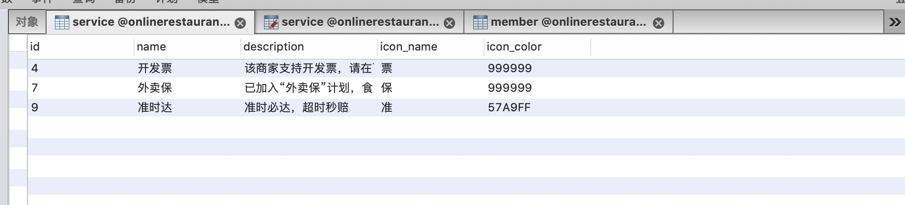
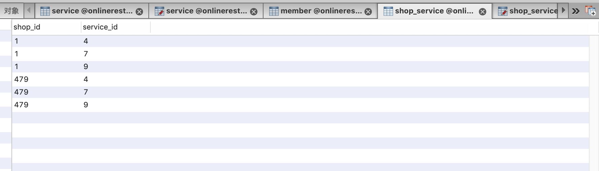

## 多表查询商家信息

在获取商家列表数据功能中，先前的功能只提供了shop单表数据的查询和返回。在实际的功能实现上，需要多表数据共同存储和商家有关的信息和数据，本节课我们来看如何实现多表数据的操作。

### 定义服务基础表
随着平台功能的不断完善，以及服务意识的提升，在各大外卖平台入驻的商家，都会提供各种各样的配套服务来保障服务质量。
我们可以把平台和商家所支持的服务进行具体的定义，作为选项让商家进行选择和提供。因此，首先定义服务基础表，通过结构体定义如下所示：
```go
//服务结构体定义
type Service struct {
	//id
	Id int64 `xorm:"pk autoincr" json:"id"`
	//服务名称
	Name string `xorm:"varchar(20)" json:"name"`
	//服务描述
	Description string `xorm:"varchar(30)" json:"description"`
	//图标名称
	IconName string `xorm:"varchar(3)" json:"icon_name"`
	//图标颜色
	IconColor string `xorm:"varchar(6)" json:"icon_color"`
}
```

在OrmEngine.go文件中，执行初始化映射操作，以便在MySQL中生成service数据表：
```go
...
err = engine.Sync2(new(model.Member),
	new(model.SmsCode),
	new(model.FoodCategory),
	new(model.Shop),
	new(model.Service))

if err != nil {
	return nil, err
}
... 
```

在如上的表结构定义中，通过ShopId来表示在服务表中的记录与服务条目的对应关系。

### 准备测试数据
在创建完成service数据表后，可以向表结构中添加一些测试数据。如下所示：
```go
[{
    "description": "已加入“外卖保”计划，食品安全有保障",
    "icon_color": "999999",
    "icon_name": "保",
    "id": 7,
    "name": "外卖保",
    "_id": "5a5859a19c2bc57d52df30b3"
  },
  {
    "description": "准时必达，超时秒赔",
    "icon_color": "57A9FF",
    "icon_name": "准",
    "id": 9,
    "name": "准时达",
    "_id": "5a5859a19c2bc57d52df30b2"
  },
  {
    "description": "该商家支持开发票，请在下单时填写好发票抬头",
    "icon_color": "999999",
    "icon_name": "票",
    "id": 4,
    "name": "开发票",
    "_id": "5a5859a19c2bc57d52df30b1"
  }]
```
如上是一些测试数据，将上述测试数据填入到数据库的service表中。如下图所示：


### 定义商铺-服务关系表
```go
/**
 * 商铺服务数据表
 */
type ShopService struct {
	ShopId    int64 `xorm:"pk not null" json:"shop_id"`
	ServiceId int64 `xorm:"pk not null" json:"service_id"`
}
```

通过shop和service两个基础表，定义了功能表商铺-服务关系表，同时初始化准备了测试数据。

### 修改商铺列表查询业务逻辑
首先修改controller业务逻辑，做如下修改，添加查询商铺服务的逻辑：
```go
...
shopService := service.NewShopService()
shops := shopService.ShopList(longtitude, latitude)
if len(shops) == 0 {
	toolbox.Failed(context, "暂未获取到商家信息")
	return
}

for _, shop := range shops {
	services := shopService.GetService(shop.Id)
	if len(services) == 0 {
		shop.Supports = nil
	} else {
		shop.Supports = &services
	}
}
toolbox.Success(context, shops)
...
```
在service中新增GetService方法，编程实现如下所示：
```go
/**
 * 根据商铺查询其对应支持的服务
 */
func (shopService *ShopService) GetService(shopId int64) []model.Service {
	shopDao := dao.NewShopDao()
	return shopDao.QueryServiceByShopId(shopId)
}
```

最终数据的操作是在dao层中实现。在ShopDao中编程实现新的方法QueryServiceByShopId，根据商铺id查询商铺对应的服务信息。
```go
func (shopDao *ShopDao) QueryServiceByShopId(shopId int64) []model.Service {
	var service []model.Service

	err := shopDao.Table("service").Join("INNER", "shop_service", " service.id = shop_service.service_id and shop_service.shop_id = ? ", shopId).Find(&service)
	if err != nil {
		fmt.Println(err.Error())
		return nil
	}
	return service
}
```

使用多表联合查询，完成对数据库的多表操作和数据查询，最终返回符合要求的复杂数据。
