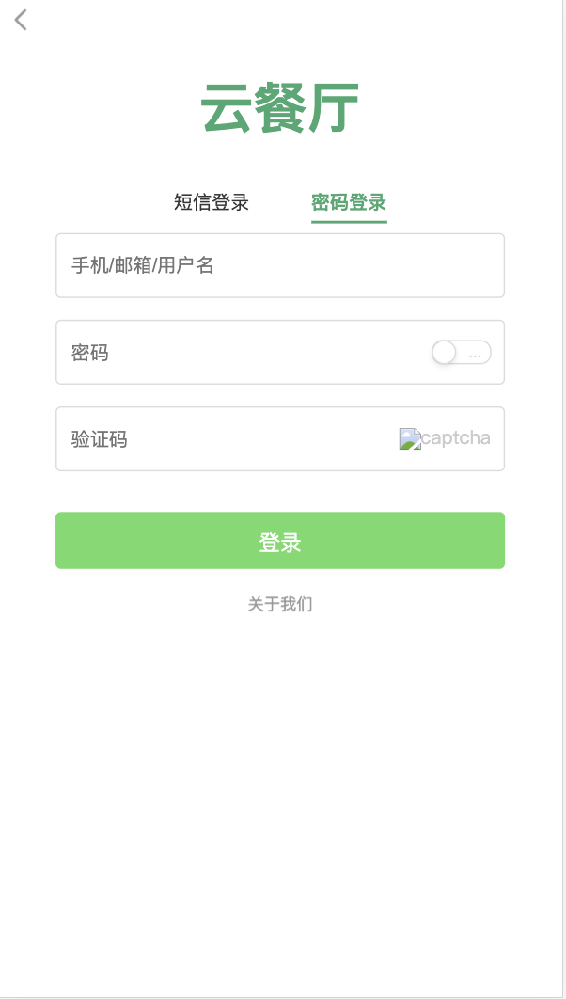
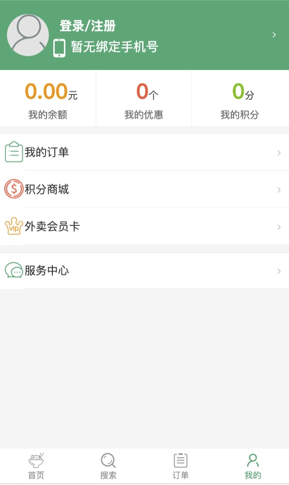
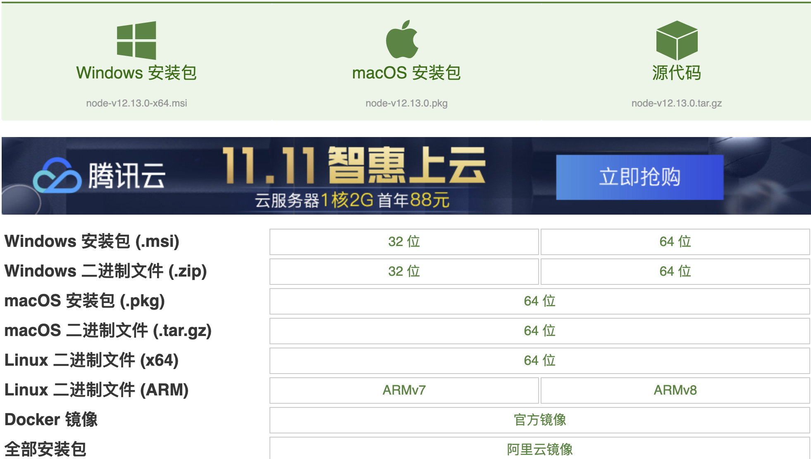

## 项目开发介绍及初始化

### 项目介绍
从本节课开始，我们将开始使用Gin框架开发一个api项目，我们起名为：云餐厅。如同饿了么，美团外卖等生活服务类应用一样，云餐厅是一个线上的外卖应用，应用的用户可以在线浏览商家，商品并下单。

该项目分为客户端和服务端两端程序。
* 1、客户端程序通过接口从服务端获取数据，获取结果后展示数据。
* 2、服务端程序提供接口Api的访问功能，执行数据库操作，并组织数据返回。

下面分别介绍客户端和服务器端两个程序：

### 客户端介绍
云餐厅客户端使用Vue、ES6、Webpack等技术进行开发，项目开发需要具备前端开发技能，我们在本课程中聚焦于后端Api功能的开发。

应用部分截图如下：






如上所示的项目截图，是云餐厅的客户端功能效果展示。

#### 环境准备
运行Vue等技术开发的客户端项目，需要安装Node.js环境。
##### 下载
可以到nodejs的下载页面：[http://nodejs.cn/download/](http://nodejs.cn/download/)下载对应的安装包。

* Windows电脑安装Nodejs环境：
    * 1、windows环境下选择.msi安装文件。然后进行双击node.msi，选择安装路径。
    * 2、配置环境变量。在计算机（或者我的电脑）右击属性 -> 高级系统设置 -> 环境变量进行配置。新建NODE_PATH变量并设置Nodejs的安装目录。
* macOS系统安装Nodejs：在终端中使用brew命令安装nodejs。详细命令：
    
    ```
    brew install nodejs
    ```
* Linux系统安装Nodejs：在nodejs的下载页面选择linux类别下的64位文件，下载文件为tar.xz格式的压缩文件。然后依次执行解压缩和建立软连接的命令：
    
    ```
    tar -xvf   node-v10.15.3-linux-x64.tar.xz
    vi /etc/profile
    export NODEJS=/opt/node/node-v10.15.3-linux-x64
export PATH=$NODEJS/bin:$PATH
    ```
    保存/etc/profile文件后，使用node -v查看node版本。

### 服务端介绍
在本课程中，我们着重进行后端项目的开发。

#### 创建项目
在gopath的src目录下，创建OnlineRestaurant目录，作为服务端项目。
```
mkdir CloudRestaurant
```

#### 创建配置文件目录
```
mkdir config
```
config目录中，配置app.json配置文件：
```
{
  "app_name": "qianfengmall",
  "app_mode": "debug",
  "app_host": "localhost",
  "app_port": "8090"
}
```
并创建Config.go文件，用于解析项目配置信息。Config.go如下：
```
type Config struct {
	AppName  string         `json:"app_name"`
	AppMode  string         `json:"app_mode"`
	AppHost  string         `json:"app_host"`
	AppPort  string         `json:"app_port"`
}
var _cfg *Config = nil
func GetConfig() *Config {
	return _cfg
}

func ParseConfig(path string) (*Config, error) {
	file, err := os.Open(path)
	if err != nil {
		panic(err)
	}
	defer file.Close()

	reader := bufio.NewReader(file)
	decoder := json.NewDecoder(reader)
	if err := decoder.Decode(&_cfg); err != nil {
		return nil, err
	}
	return _cfg, nil
}
```

#### 编写main.go
```
func main() {
    //读取配置文件
	cfg, err := toolbox.ParseConfig("./config/app.json")
	if err != nil {
		toolbox.Error(err.Error())
		return
	}
	app := gin.Default()
	app.Run(cfg.AppHost + ":" + cfg.AppPort)
}
```

#### 编写Hell world
* 编写Controller：创建controller，并创建HelloController。

    ```
    package controller
    
    import "github.com/gin-gonic/gin"
    
    type HelloController struct {
    }
    
    func (hello *HelloController) Router(engine *gin.Engine) {
    	engine.GET("/hello", hello.Hello)
    }
    
    func (hello *HelloController) Hello(context *gin.Context) {
    	context.JSON(200, map[string]interface{}{
    		"message": "hello world",
    	})
    }
    ```
* 在main.go程序中添加路由设置
```
func registerRouter(router *gin.Engine) {
        new(controller.HelloController).Router(router)
}
```


