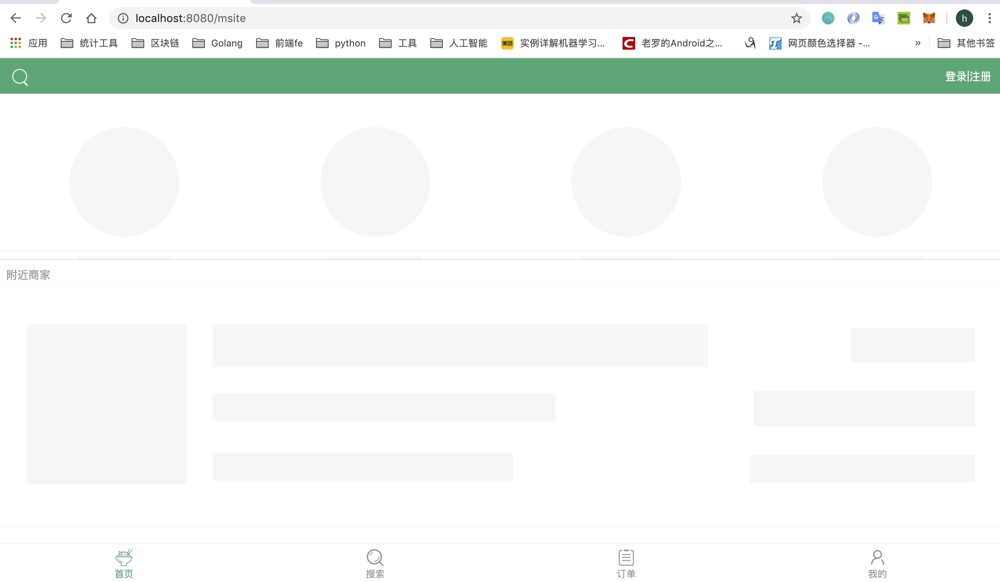
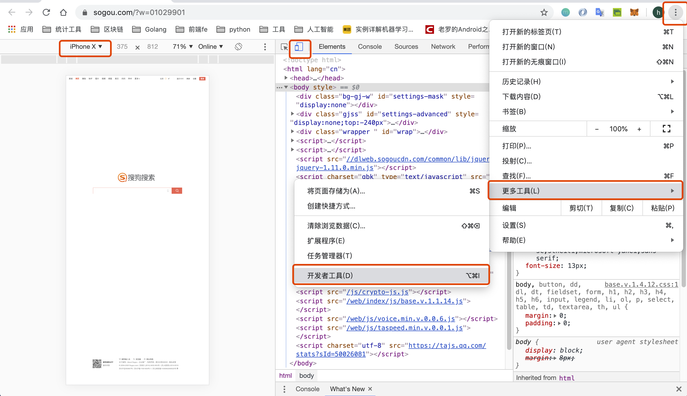

## 项目前端框架源码使用及调试说明

在上节课中，我们已经安装了Nodejs环境，并初始化了Gin项目。在本项目中我们使用前后端项目分离的方式进行前后端交互，由前端页面进行数据展示和接口请求，gin后台接口项目负责查询数据和准备数据。

我们本节课介绍一下前端框架项目的使用和调试步骤。

### 前端项目目录说明
本项目的前端项目是使用nodejs的vue框架进行开发而成的。名称为shop-client。该项目的源码如下图所示：

如上图所示的是shop-client前端项目。为了方便大家学习和了解前端框架内容，对该前端项目框架作如下解释说明：
* build：build目录是指定的项目编译目录，该项目的编译配置相关的操作，都在该目录中进行配置和指定。
* config：config目录主要是对项目全局进行相关的配置，以及测试或者发布版本进行配置。
* dist：所有的.vue页面编译后成为的js文件，都会输出到该目录中。
* node_modules：该目录是nodejs项目所需要的依赖的第三方库的代码目录。由于该目录体积较大，在进行项目迁移或者项目拷贝时，可以将该目录删除，在项目的根目录中执行npm install命令会重新生成并下载所需要的第三方的代码库。
* src：该目录是存放前端工程项目的源码目录。
* static：该目录用于存放静态的文件，比如js、css文件等。
* package.json：执行npm init命令会生成该文件，该文件是node项目的配置文件，其中包含项目的编译和第三方依赖库依赖信息等内容。

### 运行前端项目
在安装好了nodejs环境以后，可以使用命令对前端项目进行操作。

#### 进入到项目中
使用如下命令可以进入到项目中：
```nodejs
cd shop-client
```

#### 常用命令
可以使用一些常用命令对项目进行编译、测试启动运行等操作。在项目根目录下的package.json目录文件中，可以找到有scripts标签配置，其中就定义和配置了不同功能的脚本命令。scripts标签配置内容如下所示：
```nodejs
...
"scripts": {
    "dev": "webpack-dev-server --inline --progress --config build/webpack.dev.conf.js",
    "start": "npm run dev",
    "lint": "eslint --ext .js,.vue src",
    "build": "node build/build.js"
}
...
```

按照上述的脚本命令配置，可以实现很多指令功能。
比如说，可以使用如下命令运行编译项目：
```nodejs
npm run build
```
上述命令会具体执行node build/build.js命令，用于根据build.js文件对项目进行编译。


另外，还可以使用如下命令运行nodejs项目：
```nodejs
npm start
```
因为在scripts脚本中配置了start命令，只有start命令可以省略run。当然，npm start会具体执行的指令是npm run dev，因此也可以通过npm run dev命令来运行项目。

### 请求接口API
在shop-client前端项目的src目录下的api目录中，有两个js文件，分别为ajax.js文件和index.js文件。
* ajax.js文件：该文件中封装了前端项目进行异步网络请求的方法ajax，该函数包含三个参数，分别是：url、data、type，表示请求路径，请求参数和请求方法。
* index.js文件：在该文件中，引入了ajax.js文件和其中的ajax方法，定义了基础请求路径BASE_URL常量，此项目中的请求端口为8090，与后台服务器监听的端口一致。如果想自己修改服务器监听端口，要记得将前端代码BASE_URL常量中的端口也要一并修改。另外，在index.js文件中定义了本项目功能开发所需要的接口，供在.vue文件中进行使用。

### 前端页面vue源文件
在shop-client前端项目的src目录下的pages目录中，存放的是项目的页面源文件，页面源文件是.vue为扩展名的文件。

在该项目中，根据项目功能和模块划分为更详细的目录：Login、Msite、Order、Profile、Search、Shop等几个目录。

### 路由文件
在src目录下存在有router目录，其中包含一个index.js文件，该文件是前端页面的路由页面，通过该页面的路由配置，进行展示对应的前端页面的vue源文件。

路由模块使用到了第三方的路由库：vue-router。对于第三方vue-router的配置依赖，可以在package.json文件中的dependencies配置模块中找到：
```nodejs
...
"dependencies": {
    "axios": "^0.18.0",
    "better-scroll": "^1.12.6",
    "date-fns": "^1.29.0",
    "fastclick": "^1.0.6",
    "mint-ui": "^2.2.13",
    "mockjs": "^1.0.1-beta3",
    "swiper": "^4.3.3",
    "vue": "^2.5.2",
    "vue-router": "^3.0.1",
    "vuex": "^3.0.1"
}
...
```

### 项目入口
在shop-client项目根目录下的src目录中，有两个代表项目入口的文件，分别是js文件和vue文件。main.js是项目运行的总入口，在main.js文件内部，引入并使用了App.vue文件，同时引入了router路由文件。

App.vue是项目的主页面的布局，并引入了页面样式文件。

### 项目运行
需要运行前端项目进行功能调试时，执行以下步骤：

```nodejs
cd shop-client
npm run dev
```

然后在浏览器中访问8080端口:[ http://localhost:8080]( http://localhost:8080) 可以访问到前端页面，如下图所示：


在浏览器中选择更多工具 --> 开发者工具 可以调节页面效果，如下图所示：


### 说明
使用vue或者其他前端框架进行项目的前端编写，对于有些同学可能会有所吃力。着重把精力聚焦于前端框架项目的运行和使用上即可，编写能力要求不需要太高。


