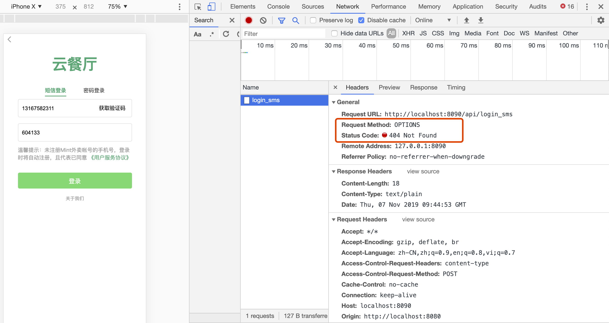
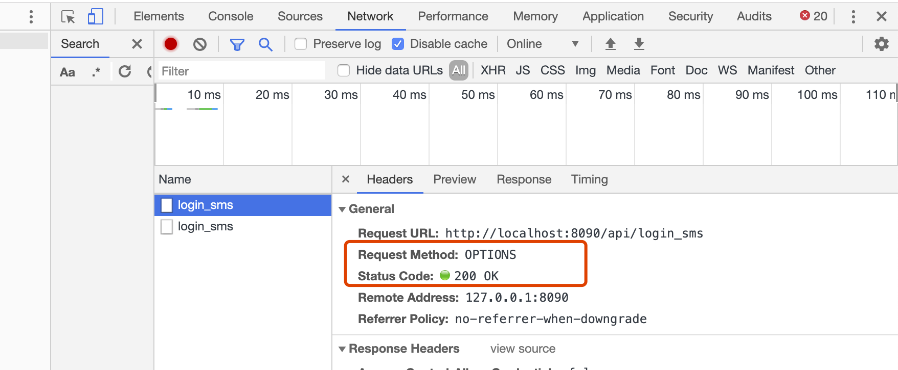
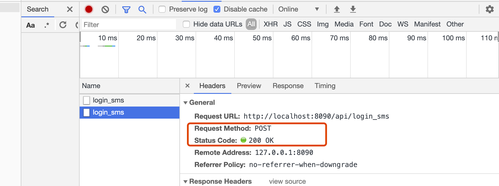

# 服务器全局跨域请求处理设置


## 问题描述
我们的项目是使用gin开发一个接口项目，前端是使用vue+webpack进行开发和编译运行的。
可以通过如下命令运行为大家提供的前端工程代码,在前端项目的根目录下执行：
```
npm run dev
```

在浏览器中访问[http://localhost:8080](http://localhost:8080)即可进入应用的首页，切换到用户登录界面。

同时后端程序的运行端口是8090。

当使用我们上面两节课已经开发完成的手机号+验证码的方式进行用户登录时。会发现遇到一个问题，如下图所示：


之前我们已经开发完成了手机号+验证码登录的功能，并且使用Postman已经测试成功了，为什么现在在浏览器中会出现这个问题呢？

## 跨域访问的问题
先了解一下什么是跨域访问。
在浏览器中的任意一个页面地址，或者访问后台的api接口url，其实都包含几个相同的部分：
* 1、通信协议：又称protocol，有很多通信协议，比如http，tcp/ip协议等等。
* 2、主机：也就是常说的host。
* 3、端口：即服务所监听的端口号。
* 4、资源路径：端口号后面的内容即是路径。

当在一个页面中发起一个新的请求时，如果通信协议、主机和端口，这三部分内容中的任意一个与原页面的不相同，就被称之为跨域访问。

如，在gin接口项目中，前端使用nodejs开发，运行在8080端口，我们访问的应用首页是：[http://localhost:8080](http://localhost:8080)。 在使用gin框架开发的api项目中，服务端的监听端口为8090。

一个端口数8080，一个是8090，两者端口不同，因此按照规定，发生了跨域访问。

## OPTIONS请求
如上文所述，前端vue开发的功能，使用axios发送POST登录请求。在请求时发生了跨域访问，因此浏览器为了安全起见，会首先发起一个请求测试一下此次访问是否安全，这种测试的请求类型为OPTIONS，又称之为options嗅探，同时在header中会带上origin，用来判断是否有跨域请求权限。

然后服务器相应Access-Control-Allow-Origin的值，该值会与浏览器的origin值进行匹配，如果能够匹配通过，则表示有跨域访问的权限。

跨域访问权限检查通过，会正式发送POST请求。

## 服务端设置跨域访问
可以在gin服务端，编写程序进行全局设置。通过中间件的方式设置全局跨域访问，用以返回Access-Control-Allow-Origin和浏览器进行匹配。

在服务端编写跨域访问中间件，详细内容如下：
```go
func Cors() gin.HandlerFunc {
	return func(context *gin.Context) {
		method := context.Request.Method
		origin := context.Request.Header.Get("Origin")
		var headerKeys []string
		for k, _ := range context.Request.Header {
			headerKeys = append(headerKeys, k)
		}
		headerStr := strings.Join(headerKeys, ",")
		if headerStr != "" {
			headerStr = fmt.Sprintf("access-control-allow-origin, access-control-allow-headers, %s", headerStr)
		} else {
			headerStr = "access-control-allow-origin, access-control-allow-headers"
		}

		if origin != "" {
			context.Writer.Header().Set("Access-Control-Allow-Origin", "*")
			context.Header("Access-Control-Allow-Origin", "*") // 设置允许访问所有域
			context.Header("Access-Control-Allow-Methods", "POST, GET, OPTIONS, PUT, DELETE,UPDATE")
			context.Header("Access-Control-Allow-Headers", "Authorization, Content-Length, X-CSRF-Token, Token,session,X_Requested_With,Accept, Origin, Host, Connection, Accept-Encoding, Accept-Language,DNT, X-CustomHeader, Keep-Alive, User-Agent, X-Requested-With, If-Modified-Since, Cache-Control, Content-Type, Pragma")
			context.Header("Access-Control-Expose-Headers", "Content-Length, Access-Control-Allow-Origin, Access-Control-Allow-Headers,Cache-Control,Content-Language,Content-Type,Expires,Last-Modified,Pragma,FooBar")
			context.Header("Access-Control-Max-Age", "172800")
			context.Header("Access-Control-Allow-Credentials", "false")
			context.Set("content-type", "application/json") //// 设置返回格式是json
		}

		if method == "OPTIONS" {
			context.JSON(http.StatusOK, "Options Request!")
		}
		//处理请求
		context.Next()
	}
}
```

其中的Access-Control-Allow-Origin的设置，表示允许进行跨域访问，*表示可以访问所有域。同时，通过Header方法进行了其他的设置。

最后context.Next()是中间件使用的标准用法，表示继续处理请求。

## 服务器设置跨域调用
在main函数中，调用编写好的跨域访问。调用如下:
```go
func main(){
    ...
    app := gin.Default()
    app.Use(Cors())
    ...
}
```
调用app.Use方法，设置跨域访问。

## 功能演示
服务器设置好跨域访问以后，重新启动服务器api程序，并在浏览器端重新访问。可以看到正常发送了OPTIONS嗅探后，正常发送了POST请求。如下图所示：




